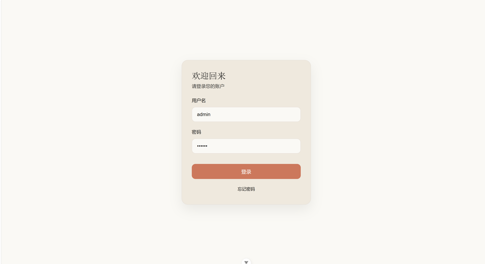
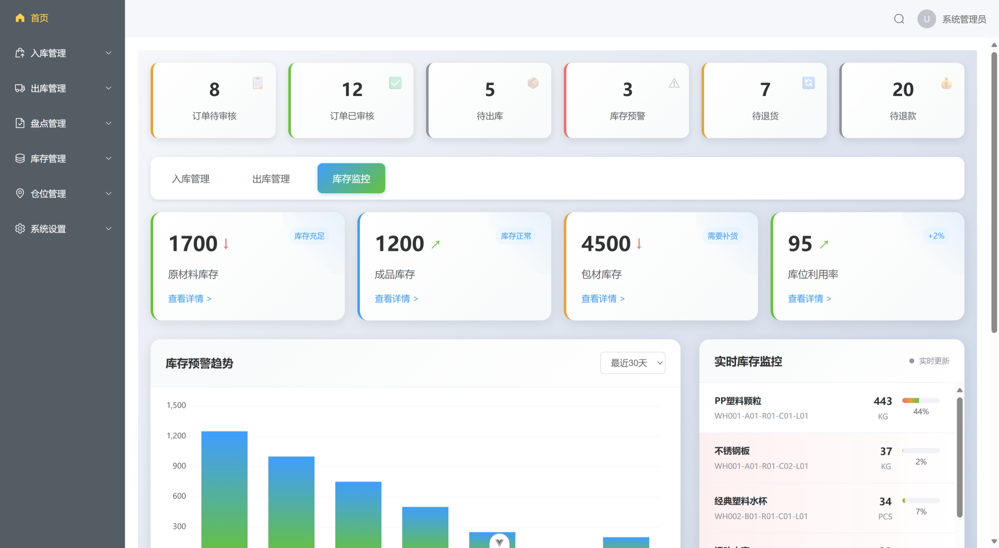
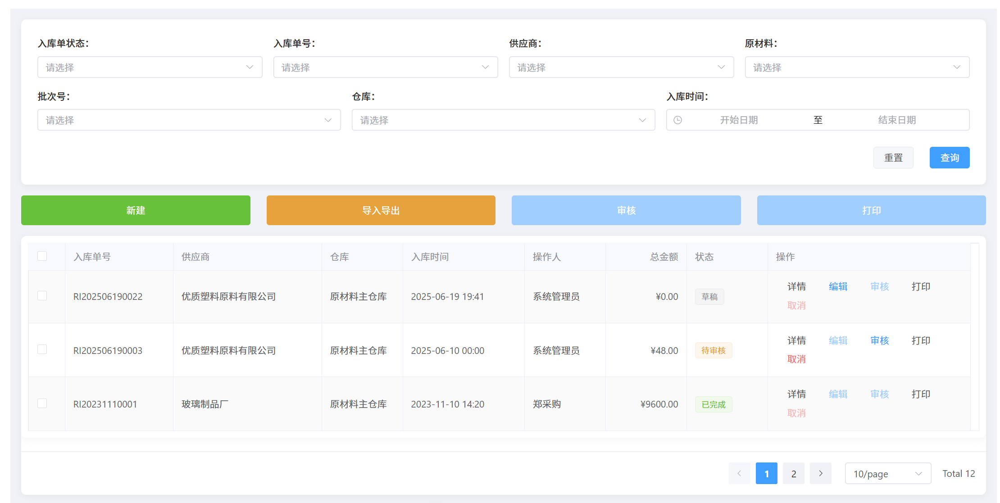

# 水杯生产企业仓储管理系统 (WMS)

## 📋 项目概述

这是一个基于 Vue 3 + TypeScript 的现代化仓储管理系统，专为水杯生产企业设计。系统提供完整的仓储管理解决方案，包括入库管理、出库管理、库存管理、盘点管理等核心功能模块。

## 🏗️ 技术架构

### 核心技术栈
- **前端框架**: Vue 3 + Composition API
- **语言**: TypeScript
- **构建工具**: Vite
- **UI组件库**: Element Plus
- **状态管理**: Pinia
- **路由管理**: Vue Router 4
- **HTTP客户端**: Axios
- **图表库**: ECharts
- **样式预处理**: SCSS

### 项目目录结构

```
WMS/
├── server/
│   └── index.js                    # 后端API接口服务
├── src/
│   ├── api/                        # API接口层
│   │   ├── index.ts               # API统一导出
│   │   └── path.ts                # API路径配置
│   ├── assets/                     # 项目静态资源
│   │   └── image/                 # 项目图片资源
│   ├── components/                 # 公共组件
│   │   ├── icons/                 # 图标组件
│   ├── router/                     # 路由配置
│   │   └── index.ts               # 路由定义与守卫
│   ├── stores/                     # 状态管理
│   │   ├── auth.ts                # 认证状态管理
│   │   └── counter.ts             # 计数器与视图状态
│   ├── styles/                     # 全局样式
│   ├── utils/                      # 工具函数
│   │   └── request.ts             # HTTP请求封装
│   ├── views/                      # 页面组件
│   │   ├── LoginView.vue          # 登录页面
│   │   ├── LogoutView.vue         # 登出页面
│   │   ├── AboutView.vue          # 关于页面
│   │   └── home/                  # 主业务模块
│   │       ├── HomeView.vue       # 主页面容器
│   │       └── components/        # 业务组件
│   │           ├── MainView.vue           # 数据大屏
│   │           ├── NavigationView.vue     # 导航组件
│   │           ├── TopView.vue            # 顶部组件
│   │           ├── InStorage/             # 入库管理
│   │           │   ├── RawMaterial.vue           # 原料入库列表
│   │           │   ├── InboundOrderCreate.vue    # 入库单创建
│   │           │   └── Review.vue                # 入库审核
│   │           ├── OutStorage/            # 出库管理
│   │           │   └── OutRawMaterial.vue        # 原料出库
│   │           ├── CheckStorage/          # 盘点管理
│   │           │   └── CheckRawMaterial.vue      # 原料盘点
│   │           ├── InventoryManage/       # 库存管理
│   │           │   └── InventoryRawMaterial.vue  # 原料库存
│   │           └── LocationManage/        # 库位管理
│   │               └── LocationRawMaterial.vue   # 原料库位
│   ├── App.vue                     # 根组件
│   └── main.ts                     # 应用入口
├── auto-imports.d.ts               # 自动导入类型声明
├── components.d.ts                 # 组件类型声明
├── env.d.ts                        # 环境变量类型声明
├── package.json                    # 项目依赖配置
├── tsconfig.app.json               # 应用TypeScript配置
├── tsconfig.json                   # 根TypeScript配置
├── tsconfig.node.json              # Node环境TypeScript配置
└── vite.config.ts                  # Vite构建配置
```

## 🎯 核心功能模块

### 1. 用户认证模块
- **登录页面** (`src/views/LoginView.vue`)
  - 响应式登录表单设计
  - 实时表单验证
  - 加载状态管理
  - 成功/错误提示模态框
  - 自动路由跳转



### 2. 数据大屏模块 (`src/views/home/components/MainView.vue`)
- **仓储数据可视化**
  - 状态栏显示关键指标
  - 入库/出库数据切换
  - 库存预警趋势图表 (ECharts)
  - 销售额排名统计
  - 实时数据更新
  


### 3. 入库管理模块 (`components/InStorage/`)

#### 原料入库管理 (`RawMaterial.vue`)
- **功能特性**:
  - 多维度筛选查询（订单状态、入库单号、原料信息等）
  - 批量操作支持（审核、打印）
  - 数据导入导出功能
  - 分页数据展示
  - 状态标签显示

#### 入库单创建 (`InboundOrderCreate.vue`)
- **功能特性**:
  - 动态表单生成
  - 原料明细动态添加/删除
  - 供应商/生产商选择
  - 批次号管理
  - 表单验证与提交



### 4. 盘点管理模块 (`components/CheckStorage/`)

#### 原料盘点 (`CheckRawMaterial.vue`)
- **功能特性**:
  - 库存数量实时对比
  - 盘盈盘亏自动计算
  - 批量盘点操作
  - 差异状态可视化
  - 数据导出功能

### 5. 其他功能模块
- **出库管理**: 原料出库流程控制
- **库存管理**: 库存数据查询与统计
- **库位管理**: 仓库位置信息管理

## 🔧 核心技术实现

### 状态管理架构 (Pinia)
```typescript
// stores/counter.ts - 视图状态管理
export const useCounterStore = defineStore('counter', () => {
  const currentView = ref('MainView')  // 当前视图控制
  const count = ref(0)
  
  return { 
    count, 
    currentView,
    increment
  }
})
```

### HTTP请求封装
```typescript
// utils/request.ts - 统一请求处理
const service = axios.create({
  timeout: 5000,
})

// 请求拦截器 - 数据格式处理
service.interceptors.request.use((config) => {
  if (config.method === "post" || config.method === "put") {
    // 根据Content-Type处理请求数据
  }
  return config
})

// 响应拦截器 - 错误统一处理
service.interceptors.response.use(
  (response) => Promise.resolve(response),
  (error) => {
    errorHandler(error.response.status, error.response.data)
    return Promise.reject(error)
  }
)
```

### 路由权限控制
```typescript
// router/index.ts - 路由守卫
{
  path: '/',
  redirect: '/home/main',
  meta: { requiresAuth: true } // 需要登录验证
}
```

## 🎨 UI/UX设计特点

### 响应式设计
- **Grid/Flexbox布局**: 适配不同屏幕尺寸
- **Element Plus组件**: 统一的设计语言
- **SCSS样式管理**: 模块化样式组织

### 交互体验
- **加载状态管理**: 防止重复提交
- **表单验证反馈**: 实时错误提示
- **操作确认机制**: 重要操作二次确认
- **数据分页处理**: 大数据集性能优化

### 视觉设计特点
- **卡片式布局**: 清晰的信息层次
- **状态标签系统**: 直观的数据状态展示
- **图表数据可视化**: ECharts集成
- **统一色彩系统**: 品牌一致性

## 🚀 快速开始

### 环境要求
```bash
Node.js >= 16.0.0
npm >= 8.0.0
```

### 安装与运行
```bash
# 安装依赖
npm install

# 开发环境启动
npm run dev
node server/index.js

# 生产环境构建
npm run build

# 类型检查
npm run type-check
```

## 📊 数据流架构

```
用户操作 → Vue组件 → Pinia Store → API请求 → 后端服务
    ↓
UI更新 ← 状态更新 ← 响应处理 ← HTTP Response ← 数据库
```

## 🔐 权限与安全

### 认证机制
- **路由守卫**: 基于`meta.requiresAuth`的访问控制
- **状态管理**: Pinia管理用户登录状态
- **请求拦截**: 统一添加认证信息

### 错误处理
- **HTTP错误**: 统一错误处理机制
- **表单验证**: 客户端数据验证
- **用户反馈**: 友好的错误提示

## 📈 性能优化策略

### 代码优化
- **组合式API**: 更好的逻辑复用
- **组件懒加载**: 路由级别的代码分割
- **响应式优化**: 合理使用`ref`和`reactive`

### 构建优化
- **Vite构建**: 快速的开发和构建体验
- **TypeScript**: 类型安全与开发效率
- **自动导入**: 减少手动导入代码

## 🛠️ 开发规范

### 代码风格
- **组合式API**: 统一使用Composition API
- **TypeScript**: 全面的类型检查
- **ESLint**: 代码质量保证

### 命名约定
- **组件**: PascalCase (如: `RawMaterial.vue`)
- **文件**: kebab-case
- **变量**: camelCase
- **常量**: UPPER_SNAKE_CASE

## 📋 项目状态

### 已完成功能
- ✅ 用户认证系统
- ✅ 数据大屏展示
- ✅ 入库管理核心功能
- ✅ 盘点管理基础功能
- ✅ HTTP请求封装
- ✅ 状态管理架构

### 待完善功能
- 🔄 出库管理完整流程
- 🔄 库存管理高级功能
- 🔄 库位管理详细功能
- 🔄 数据报表系统
- 🔄 系统配置管理

## 🤝 开发贡献

### 开发流程
1. 克隆项目到本地
2. 安装依赖并启动开发服务器
3. 根据功能模块进行开发
4. 遵循代码规范进行提交

### 问题反馈
如遇到问题或有功能建议，请通过以下方式反馈：
- 项目Issue跟踪
- 代码审查机制
- 技术文档维护


> [!TIP]
> 本项目正在持续开发中，部分功能可能需要进一步完善。建议在开发前详细了解各模块的实现逻辑和数据流向。