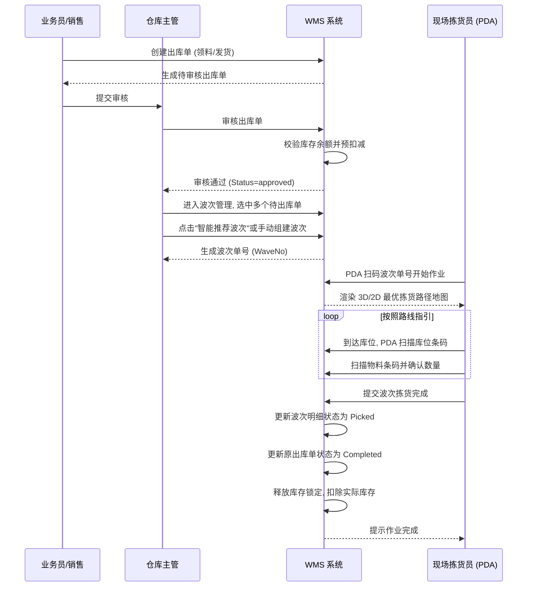
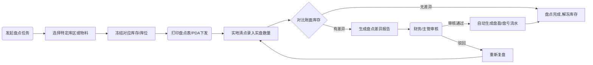

# WMS 业务流程与泳道图 (Business Flow & Swimlane Diagram)

## 1. 核心入库业务流程 (Inbound Flow)

```mermaid
graph TD;
    A[供应商发货/采购到货] --> B(仓库收货员创建入库单);
    B --> C{是否草稿?};
    C -- 是 --> D[保存为草稿,不扣库存];
    C -- 否 --> E[提交待审核];
    E --> F[仓库主管/质检员审核];
    F -->|审核驳回| G[单据作废/修改重提];
    F -->|审核通过| H[系统自动增加库存];
    H --> I[记录 Inventory Transaction 流水];
    I --> J[更新相关库位占用状态 (Occupancy)];
    J --> K[入库完成, 可选打印入库交接单];
```

## 2. 核心出库与波次拣货泳道图 (Outbound & Wave Picking Swimlane)



## 3. 库存盘点业务流程 (Stocktaking Flow)

