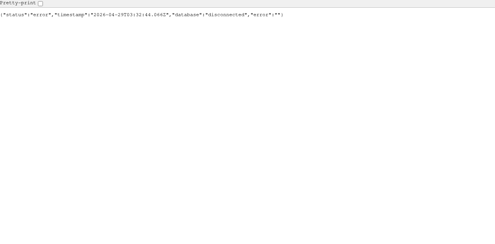
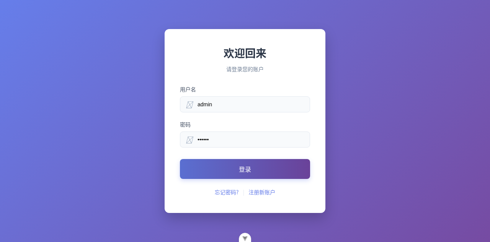

# Dogfood Report: WMS (feature/general-wms)

| Field | Value |
|-------|-------|
| **Date** | 2026-04-29 |
| **App URL** | http://localhost:5173 |
| **Session** | general-wms |
| **Scope** | 全系统冒烟测试（受限：后端数据库未连接，导致绝大多数业务接口不可用） |

## Summary

| Severity | Count |
|----------|-------|
| Critical | 2 |
| High | 0 |
| Medium | 0 |
| Low | 0 |
| **Total** | **2** |

## Issues

### ISSUE-001: 后端健康检查返回 500（数据库未连接）

| Field | Value |
|-------|-------|
| **Severity** | critical |
| **Category** | functional |
| **URL** | http://localhost:3000/health |
| **Repro Video** | N/A |

**Description**

后端服务启动后，`/health` 返回 500，响应体标记 `database: disconnected`。预期健康检查接口返回 200 并反映服务可用性；实际为数据库未连接导致服务不可用，后续大部分业务接口（登录、单据、库存等）都会失败。

**Repro Steps**

1. 打开 `http://localhost:3000/health`
   

---

### ISSUE-002: 登录接口返回 500，导致无法进入系统

| Field | Value |
|-------|-------|
| **Severity** | critical |
| **Category** | functional |
| **URL** | http://localhost:5173/login |
| **Repro Video** | N/A |

**Description**

在登录页输入账号密码并点击“登录”，页面不会进入主系统。由于后端数据库未连接，`POST /api/users/login` 返回 500（`{"message":"登录失败"}`），导致无法完成认证流程。预期登录失败时给出明确错误提示（例如“数据库未连接/服务不可用”）并保持可重试状态。

**Repro Steps**

1. 打开登录页 `http://localhost:5173/login`
   

2. 输入用户名与密码
   

3. 点击“登录”
   

---
