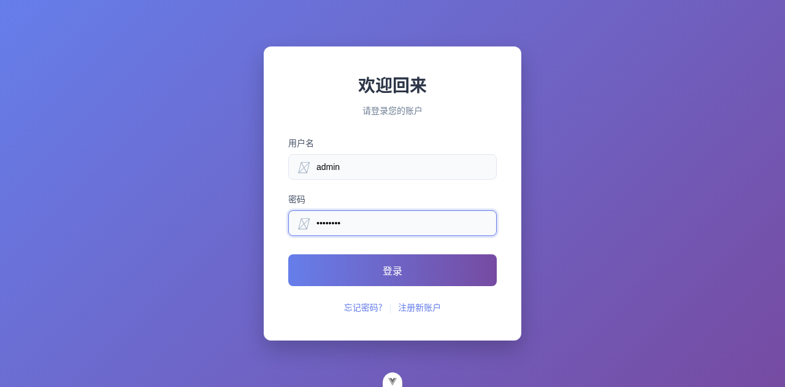

# Dogfood Report: GenWMS（Node.js 通用型仓储）

| Field | Value |
|-------|-------|
| **Date** | 2026-05-03 |
| **App URL** | http://localhost:5175 |
| **Session** | genwms-dogfood |
| **Scope** | 冒烟 + 登录链路验证（受限：运行环境未启动 MySQL，导致后端不可用） |

## Summary

| Severity | Count |
|----------|-------|
| Critical | 2 |
| High | 0 |
| Medium | 0 |
| Low | 0 |
| **Total** | **2** |

## Issues

### ISSUE-001: 后端健康检查返回 500（数据库未连接）

| Field | Value |
|-------|-------|
| **Severity** | critical |
| **Category** | functional |
| **URL** | http://localhost:3000/health |
| **Repro Video** | N/A |

**Description**

后端进程可启动，但 `GET /health` 返回 500，响应体显示 `database: disconnected`。该问题会导致登录与所有业务 API 无法正常工作。

**Repro Steps**

1. 请求 `http://localhost:3000/health`
2. **Observe:** 返回 500，且 `database=disconnected`

---

### ISSUE-002: 登录链路被后端 500 阻塞（无法进入系统）

| Field | Value |
|-------|-------|
| **Severity** | critical |
| **Category** | functional |
| **URL** | http://localhost:5175/login |
| **Repro Video** | N/A |

**Description**

登录页可正常加载，但由于后端数据库未连接，点击“登录”无法进入系统。

**Repro Steps**

1. 打开登录页
   

2. 输入用户名/密码（例如 `admin/admin123`）
   

3. 点击“登录”
   

---
