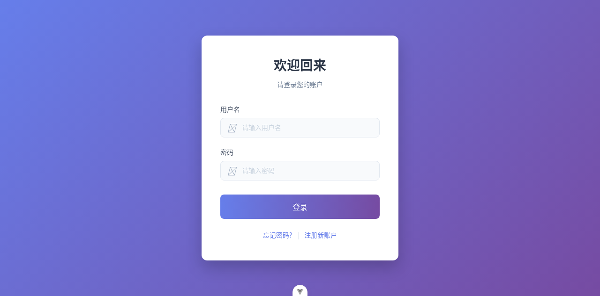
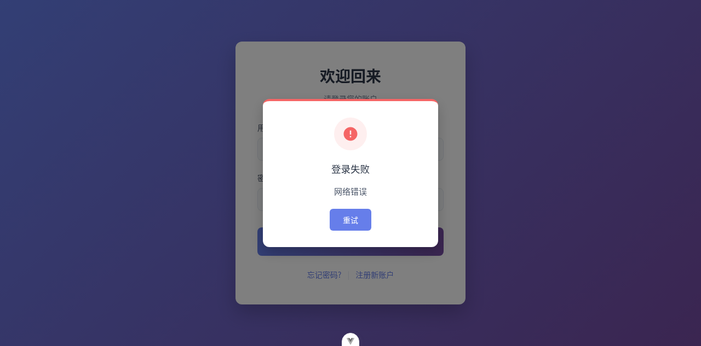

# Dogfood Report: General WMS

| Field | Value |
|-------|-------|
| **Date** | 2026-04-27 |
| **App URL** | http://127.0.0.1:5173 |
| **Session** | integrated_browser |
| **Scope** | 登录、仪表盘、基础资料、入库/出库/库存/盘点/波次/打印关键链路 |

## Summary

| Severity | Count |
|----------|-------|
| Critical | 1 |
| High | 0 |
| Medium | 0 |
| Low | 0 |
| **Total** | **1** |

## Issues

<!-- Copy this block for each issue found. Interactive issues need video + step-by-step screenshots. Static issues (typos, visual glitches) only need a single screenshot -- set Repro Video to N/A. -->

### ISSUE-001: 正确账号密码登录失败（阻断全流程）

| Field | Value |
|-------|-------|
| **Severity** | critical |
| **Category** | functional |
| **URL** | http://127.0.0.1:5173/login |
| **Repro Video** | N/A |

**Description**

在登录页输入正确账号密码（admin / admin123）点击“登录”后，页面弹出“登录失败”，未跳转到系统首页，导致后续所有功能无法继续验证。

已定位原因：前端曾直接请求 `http://localhost:3000`（在远程调试/容器环境下不可达，浏览器侧表现为 Network error）。
已修复：将前端请求改为走同源 `/api`，由 Vite proxy 转发到后端，避免跨域与 localhost 可达性问题。

**Repro Steps**

1. 打开登录页 http://127.0.0.1:5173/login
   

2. 输入用户名 admin，密码 admin123，点击“登录”

3. **观察：** 弹出“登录失败”
   

---
## 编译与构建\n- TypeScript 检查：已通过 (`vue-tsc --build`)\n- 生产构建：已通过 (`vite build`)
